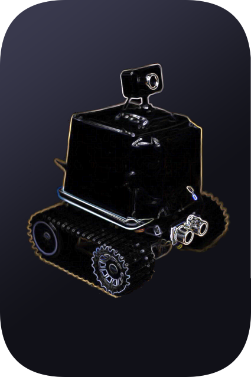

  

<h1 align="center">
  Robot Rolly
</h1>

## Robot-Rolly &middot;         ##

This repository contains the code and configuration for deploying and running the `Robot Rolly` project, which is a hardware/software assistant robot.

The project is composite and includes the following components:
- Server side (`ROS`, `Python`, `Java`)
- RPI3B+ part (`ROS`, `Python`)
- Android part (`Android Studio`, `Java`)

**Functional diagram** 

  

**Circuit diagram** 

  
   

## :desktop_computer: Server part of the project ##

This part of the project will be responsible for performing computationally expensive operations, such as face recognition, speech recognition and synthesis, etc.

Full list of features:
- `Robot Rolly` platform configuration update
- Web news/weather parsing
- Speech recognition (offline)
- Speech synthesis (offline)
- Face recognition and user identification (offline)
- Receiving information from the `Android` part of the software via `WiFi`

## :computer: RPI3B+ part of the project ##

This part of the project will be responsible for detecting obstacles, controlling the chassis of the robot's hardware platform, recording voice commands and playing audio files, etc.

Full list of features:
- Photographing
- Video filming
- Audio recording
- Carrying out training according to a given scenario
- Play reminders
- Play audio files
- Time playback
- Reading news/weather sent by the server part of the software
- Chassis control of the robot by voice commands recognized by the server part of the software/commands received by the server part via `WiFi`/commands received by `RPI3B+` via `Bluetooth` from an `Android` device
- Reproduction of the results of identification by face recognition, carried out by the server part of the software
- Update configuration of `RPI3B+` part received from server part via `WiFi` or from `Android` part via `Bluetooth`

## :iphone: Android part of the project ##

This part of the project will be responsible for configuring the robot (entering trusted persons, setting training modes, setting reminders, video recording parameters, etc.) and transmitting commands to control the robot's chassis via `WiFi`/`Bluetooth`.

Full list of features:
- Adding new users whose commands the robot `Rolly` will execute (name and photo of the person)
- Workout settings (the robot can be used as a personal fitness trainer)
- Add reminder
- Choice of voice (male / female) of the robot
- Robot chassis control via `WiFi`/`Bluetooth`

**:framed_picture: Illustrations:** 

    
    
    

    
    
    

**:clapper: Example using (GIF):** 

This animation demonstrates scenarios for using the Robot Rolly. 

  

### :bookmark_tabs: Licence ###
Robot Rolly is [CC BY-NC-SA 3.0 licensed](./LICENSE).
